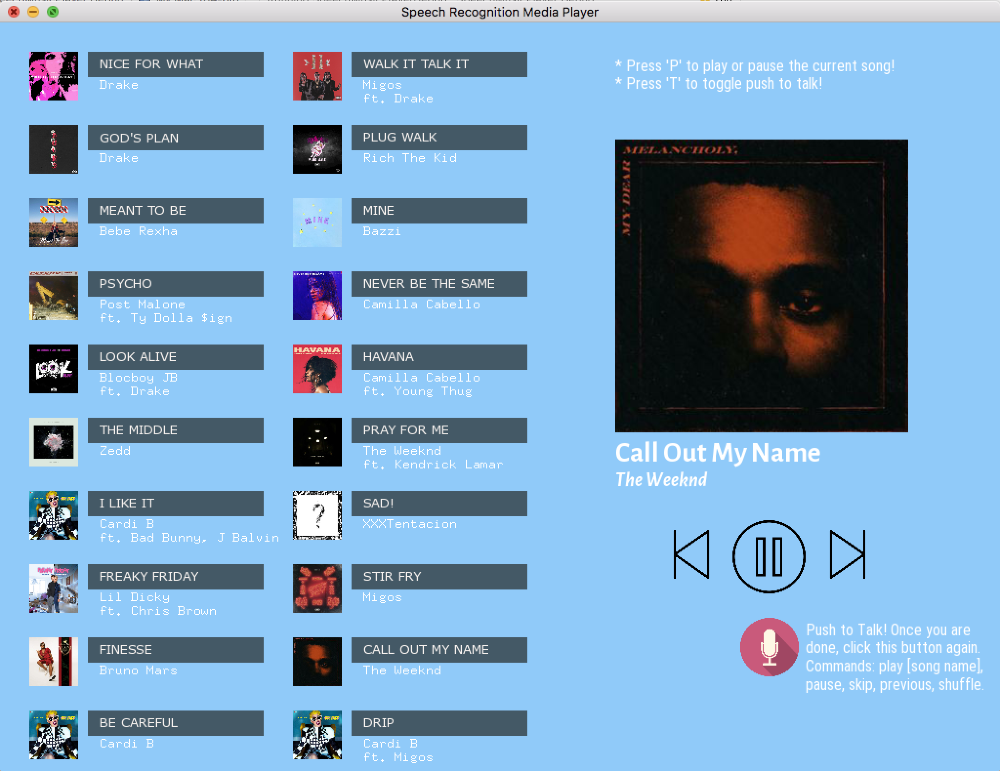

# Speech Recognition Media Player

A music player that uses speech recognition to play the Top 20 Billboard songs (as of 4/20).

## Building and Running
To run this application, simply download the project. Make sure you have the following libraries compiling correcly within the project:

1. [JSON for Modern C++](https://github.com/nlohmann/json#serialization--deserialization)
2. [ofxDatGui](https://github.com/braitsch/ofxDatGui)
3. [ofxGSTT](https://github.com/fx-lange/ofxGSTT)
4. [ofxJSON](https://github.com/jeffcrouse/ofxJSON)
5. [ofxSSL](https://github.com/fx-lange/ofxSSL)

Once you have ensured that these libraries are correctly compiling within your project, run the application!

##  Features
 There are buttons of the top 20 songs that you can play, and you can also click the microphone button to speak commands to the applications. You can choose to play, pause, and skip, just like a regular media player. The speech commands include:

1.  _play [song_name]_, plays the song name that was spoken.
2. _play_, resumes playback.
3. _pause_, pauses playback.
4. _skip_, skips to the next song.
5. _previous_, goes to the previous song.
6. _shuffle_, plays a random song.

There are two key bindings as well:

1. 'P', for pausing or playing the current song.
2. 'T', for toggling push to talk.

## Application Screenshot

